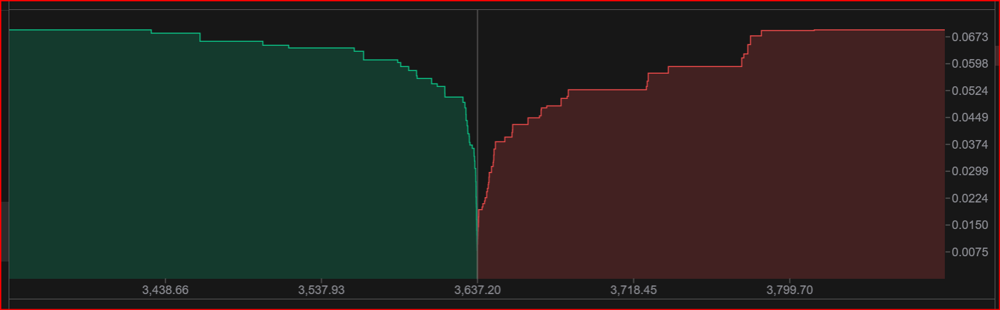

# @real2sport/depth-chart

交易平台自定义深度图表组件，使用vue3和vue-konva开发

## 功能

1、自适应屏幕分辨率，宽度、高度自适应

2、支持价格、数量、小数位精度控制

3、支持所有元素的颜色、样式控制

## 预览

详见 [预览](https://vyulinlin.github.io/depth-chart-demo/dist/index.html).

# 示意图


<video autoplay="true" controls="controls"  src="https://private-user-images.githubusercontent.com/28807436/400177436-2c2266f4-a3ea-4abb-be43-6a9f8f687b4b.mp4?jwt=eyJhbGciOiJIUzI1NiIsInR5cCI6IkpXVCJ9.eyJpc3MiOiJnaXRodWIuY29tIiwiYXVkIjoicmF3LmdpdGh1YnVzZXJjb250ZW50LmNvbSIsImtleSI6ImtleTUiLCJleHAiOjE3MzYwNTA0MDEsIm5iZiI6MTczNjA1MDEwMSwicGF0aCI6Ii8yODgwNzQzNi80MDAxNzc0MzYtMmMyMjY2ZjQtYTNlYS00YWJiLWJlNDMtNmE5ZjhmNjg3YjRiLm1wND9YLUFtei1BbGdvcml0aG09QVdTNC1ITUFDLVNIQTI1NiZYLUFtei1DcmVkZW50aWFsPUFLSUFWQ09EWUxTQTUzUFFLNFpBJTJGMjAyNTAxMDUlMkZ1cy1lYXN0LTElMkZzMyUyRmF3czRfcmVxdWVzdCZYLUFtei1EYXRlPTIwMjUwMTA1VDA0MDgyMVomWC1BbXotRXhwaXJlcz0zMDAmWC1BbXotU2lnbmF0dXJlPTM3NWQ4NzkzOTI3OTA0MGExOTdiMmNhYzk2YThmODAwNDg1ZmYxN2NlNjE5ODhhMmMzOWZkN2Q5NmUyMWRjNGImWC1BbXotU2lnbmVkSGVhZGVycz1ob3N0In0.7FzFVdA2yPQq34TRIkN8MXsEKVWTH_2zm11c2nUyj3I" title="asstes/depth2025.mp4"></video>
</video>

# 使用方式

## 1. 安装

`npm i @real2sport/depth-chart`

## 2. 引用

```javascript
import { createApp } from 'vue'
import App from './App.vue'
import depthChart from '@real2sport/depth-chart'
// vue3 全局引用
const app = createApp(App)
app.use(depthChart)
app.mount('#app')
```

```vue
<!-- 组件引用 -->
<script setup lang="ts">
import { depthChart } from '@real2sport/depth-chart'
</script>
```

### 2.1 全部可选配置
```typescript
// 深度图数据结构
interface IDepthItem {
  price: number
  amount: number
  totalAmount: number
}
// 深度图配置项
interface IDepthItemPropsOptions {
  width: number // 总宽
  height: number // 总高
  marginX: number // 右侧数量宽度
  marginY: number // 底部价格高度
  fontSize: number // // 坐标轴字体大小
  fontColor: string // 坐标轴字体颜色
  bidsColor: string // 买盘颜色
  asksColor: string // 卖盘颜色
  bidsBgColor: string // 买盘背景颜色
  asksBgColor: string // 卖盘背景颜色
  dottedBgColor: string // 虚线背景色
  axisColor: string // 中线及刻度线颜色
  tipFontSize: number // 提示字体大小
  tipColor: string // 飘窗字体颜色
  axisXBgColor: string // X坐标轴背景色
  axisYBgColor: string // Y坐标轴背景色
  axisXBorderColor: string // X坐标轴边框色
  axisYBorderColor: string // Y坐标轴边框色
  axisLineWidth: number // 刻度线宽度
  tipPriceText: string // 提示价格文字
  tipTotalText: string // 提示总价文字
  wheel: number // 默认鼠标滚轮步长，数值越大，展示的数据量越多
  isRedUp: boolean // 默认false红跌绿涨，true红涨绿跌
}
```

## 3.调用

[示例项目](https://github.com/VYuLinLin/depth-chart-demo)

示例：example/App.vue

```vue
<depthChart :options="options" :symbolData="symbolData" :depthData="depthData"></depthChart>
```
